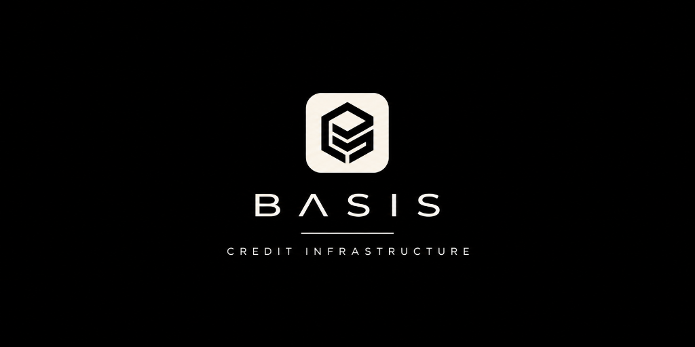

<p align="center">
  
</p>

# BASIS: Non-Collateralized DeFi Credit Protocol

**BASIS** is a decentralized, non-collateralized credit protocol that converts multi-chain economic track records into cryptographic credit lines using **Attestcoin (USC)** cross-chain state verification and **Creditcoin (CC3)** settlement.

Traditional DeFi relies on over-collateralization (e.g. 150% deposit for a 100% borrow). BASIS unlocks true undercollateralized capital by proving historical economic reputation—analyzing capital independence, economic diversity, and behavioral coherence—while neutralizing Sybil attacks and circular wash-trading.

---

## 1. Architecture & Repository Structure

```
Basis/
├── src/
│   ├── app/                  # Next.js App Router (Dashboard Page + 30 /api/* REST endpoints)
│   ├── components/           # UI components, layout (AppShell), and icon library
│   ├── features/             # Home, Credit, Borrow/Repay, Activity, Evidence, Wallets, Networks, Settings, FarmTest
│   ├── store/                # Centralized state management (StoreProvider)
│   ├── services/             # Client API service layer & backend application services
│   ├── db/                   # Drizzle ORM schema and PostgreSQL client (Supabase compatible)
│   ├── domain/               # Domain models, protocols, evidence math, credit engine
│   ├── providers/            # ChainProvider, AttestcoinProvider, CreditcoinProvider
│   └── lib/                  # Runtime config, HTTP utilities, rate limiters
│
├── public/                   # Official logo, banner, and favicon branding assets
├── tests/                    # 51 comprehensive unit and invariant tests
├── scripts/                  # seed.ts, calibrate.ts
├── docs/                     # Technical specifications and guides
├── .env.example              # Environment configuration template
└── package.json              # Unified full-stack scripts (Next.js 16)
```

---

## 2. Quickstart & Installation

### Prerequisites
- **Node.js**: v18.0.0 or higher (v20+ recommended)
- **npm**: v9.0.0 or higher

### 1. Install Dependencies
```bash
npm install
```

### 2. Run the Application
BASIS runs completely out of the box in **Demo Mode** without needing external RPC keys or a live database:

```bash
npm run dev
```
Open **`http://localhost:3000`** in your browser. The frontend dashboard and the complete backend API run together on this single port.

---

## 3. Quantitative Evidence Engine

The core algorithmic differentiator of BASIS is its quantitative reputation formula:

$$S = C^{0.45} \times D^{0.30} \times Q^{0.25}$$

Where:
- **$C$ (Capital Independence)**: Quantifies the degree to which capital inflows originate from independent external economic entities, penalized by the Herfindahl-Hirschman Index (HHI) of funding sources and circular graph flows.
- **$D$ (Economic Diversity)**: Quantifies the breadth of independent protocols (Uniswap, Aave, Lido, Morpho), asset types, and transaction counterparty entropy.
- **$Q$ (Behavioral Coherence)**: Quantifies the organic timing entropy and naturalness of interaction sequences, penalizing scripted sub-second bursts and instant deposit-withdraw round trips.

### Linear Credit Decision
Credit increases are strictly linear in the evidence score, capped at the configured batch maximum ($5,000):

$$\Delta \text{Limit} = S \times \text{BatchMax}$$

If $S < 0.10$, the decision produces $\$0$ credit increase (blocked by the safety threshold).

---

## 4. Key Interactive Flows

### 1. Borrow and Repay
- Navigate to the right rail or top bar **Borrow** / **Repay** buttons.
- Test real double-entry balance updates, available credit consumption, and repayment restorations against the backend credit service.

### 2. 9-Stage "Build Credit" Pipeline
- Click **Build Credit** in the top bar or Evidence view.
- Launches the 9-stage asynchronous pipeline:
  1. `RESOLVE_TARGETS` (Wallet and protocol discovery)
  2. `INGEST_EVM_BLOCKS` (Querying Sepolia and Base block ranges)
  3. `DECODE_RECEIPTS` (Decoding logs, transfers, and contract calls)
  4. `NORMALIZE_EVENTS` (Mapping raw transactions to standardized economic events)
  5. `FETCH_ATTESTATIONS` (Attestcoin BlockProver consensus checks)
  6. `BUILD_MERKLE_PROOFS` (Constructing Merkle Patricia Trie receipt proofs)
  7. `CALCULATE_EVIDENCE` (Executing $S = C^{0.45} \times D^{0.30} \times Q^{0.25}$)
  8. `DECIDE_CREDIT_LIMIT` (Applying guardrails, caps, and cooldowns)
  9. `COMMIT_LEDGER` (Settling limit increases to Creditcoin CC3)

### 3. Sybil & Farm Verification (`/farm-test`)
- Navigate to the **Sybil & Farm Verification** view in the sidebar.
- Compare **Genuine Organic History** ($S \approx 0.84$, awarded $+\$4,212.50$) with **Manufactured Farm Activity** ($S \approx 0.04$, $\$0$ credit increase, blocked).

### 4. Attestcoin Proof Inspection
- Click any verified transaction in the **Activity** feed or **Evidence** view.
- The slide-out technical drawer inspects block hashes, USC `chainKey`, receipt roots, MPT inclusion proofs, and attestor quorum status.

---

## 5. Testing & Verification

### Running Unit & Invariant Tests
Execute all 51 automated backend tests:
```bash
npm run test
```
Verifies closed-form mathematical equations, cooldown timers, double-entry ledger invariants, Sybil attack protections, and normalization determinism.

### Running Engine Calibration
Verify mathematical calibration against real scenario data:
```bash
npm run calibrate
```
Expected output:
- `strong-history`: Score $S = 0.8425 \implies +\$4,212.50$ credit increase.
- `manufactured-activity`: Score $S = 0.0491 \implies \$0.00$ credit increase (blocked).

### Building for Production
```bash
npm run build
```
Builds both the Next.js backend and the Vite frontend with zero errors.

---

## 6. Live / Testnet Mode Setup

To run against live testnets (Creditcoin CC3, Ethereum Sepolia, Base Sepolia):
1. Copy `.env.example` to `backend/.env`.
2. Set `APP_MODE=live`.
3. Provide a secure random `SESSION_SECRET`:
   ```bash
   openssl rand -hex 32
   ```
4. Set real RPC endpoints (`SEPOLIA_RPC_URL`, `BASE_SEPOLIA_RPC_URL`, `CREDITCOIN_RPC_URL`).
5. Run PostgreSQL and configure `DATABASE_URL`.
6. Start the backend: `npm run dev:backend`.

---

## 7. Documentation Index

- [Architecture & Invariants](docs/ARCHITECTURE.md)
- [REST API Specification](docs/API.md)
- [Attestcoin (USC) Proofs](docs/ATTESTCOIN.md)
- [Creditcoin (CC3) Settlement](docs/CREDITCOIN.md)
- [Economic Evidence Engine](docs/ECONOMIC-EVIDENCE.md)
- [External Integrations](docs/INTEGRATIONS.md)
- [Demo Scenarios](docs/DEMO.md)
- [Backend Merge Report](BACKEND-MERGE.md)
